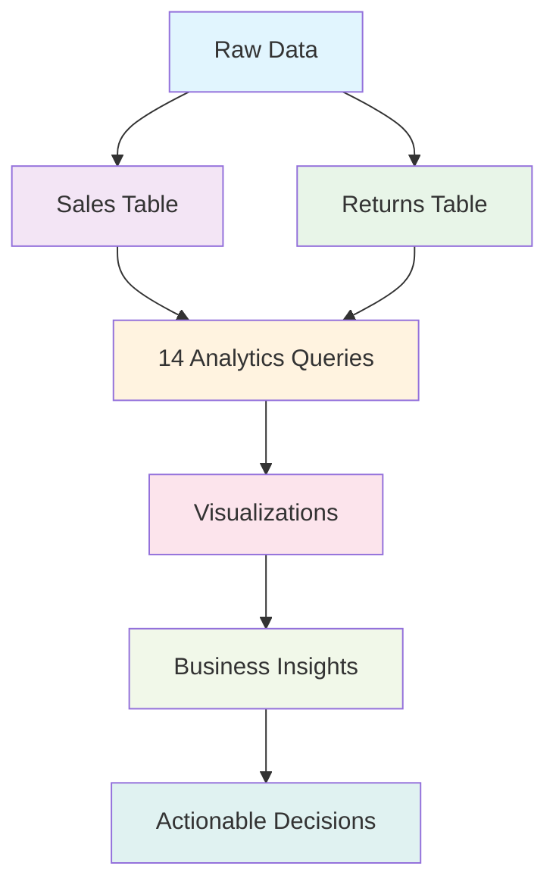

# 🚀 Sell Best - AI Inventory Intelligence Platform

## 📋 Table of Contents
- [⚙️ Installation & Setup](#️-installation--setup)
- [🏗️ Project Structure](#️-project-structure)
- [🚀 How to Run](#-how-to-run)
- [🔧 Key Dependencies](#-key-dependencies)

---

## ⚙️ Installation & Setup

### 📋 Prerequisites
- **Python 3.8 or higher**
- **Git**

### 🔄 Step-by-Step Installation

#### 1. **Clone the Repository**
```bash
git clone https://github.com/your-username/sell-best-ai-inventory.git
cd sell-best-ai-inventory
```

#### 2. **Create Virtual Environment** (Recommended)
```bash
# Windows
python -m venv venv
venv\Scripts\activate

# macOS/Linux
python -m venv venv
source venv/bin/activate
```

#### 3. **Install Python Dependencies**
```bash
pip install --upgrade pip
pip install -r requirements.txt
```

#### 4. **Install Streamlit** (If not included in requirements.txt)
```bash
pip install streamlit
```

#### 5. **Setup Environment Variables**
Create a `.env` file in the root directory:
```env
API_kay=your_openweather_api_key_here
```

#### 6. **Verify Installation**
```bash
python -c "import streamlit, pandas, sklearn, plotly; print('✅ All dependencies installed successfully!')"
```

---

## Project Structure

```
sell-best-ai-inventory/
│
├── analytics_engine/           # ML Processing Modules
│   ├── demand_processor.py        # Demand matching & geospatial analysis
│   ├── channel_processor.py       # Multi-platform analytics
│   ├── weather_processor.py       # Weather impact analysis
│   ├── smart_forecast_processor.py # Time-series forecasting
│   ├── segmentation_processor.py  # K-means customer clustering
│   ├── product_lifecycle_processor.py # ML lifecycle classification
│   ├── price_sensitivity_processor.py # Price elasticity modeling
│   └── manual_viability_processor.py # Manual analysis support
|
├── all_SQL_queries/            # Databricks Dashboard SQL Queries
│   ├── TREND_&_STOCK_RULE.sql              # Category performance & stock recommendations
│   ├── WEATHER_IMPACT_STATISTICS.sql         # Weather-based transaction analysis
│   ├── Demand_Matching.sql                  # KNN-based demand matching with Haversine
│   ├── Monthly_Revenue_by_Platform_from_Sales_Data.sql # Channel revenue trends
│   ├── Market_Share.sql                    # Platform market share analysis
│   ├── Sales_Performance_by_Platform_and_Product_Variety.sql # Platform metrics
│   ├── Smart_Forecast.sql                 # Predictive analytics with seasonal trends
│   ├── High_Demand_zone.sql               # Geographic segmentation & risk analysis
│   ├── Product_Lifecycle_Classification.sql  # Product trend analysis via regression
│   ├── PRODUCT_DEMAND_TRENDS.sql          # Monthly demand line data
│   ├── Price_vs_Demand_Relationship.sql    # Price elasticity modeling
│   ├── Profit_Impact_Analysis.sql         # Discount simulation & break-even
│   └── Sell Near Me.lvdash.json          # Complete Databricks dashboard config
|
├── data set/
|   ├──Amazon_Flipkart_Returns_MIXED.xlsx
|   ├──Instant_Delivery_Sales_MIXED.xlsx
|
├── separate code/              # Original Analysis Scripts
│   ├── near1.py to near12.py      # Individual ML experiments
│   └── README files               # Analysis documentation
│
├── 📄 app.py                      # 🚀 Main Application Entry Point
├── 📄 ingestion.py                # 📤 Data Upload & Processing
├── 📄 dashboard.py                # 📊 Main Dashboard Overview
├── 📄 manual.py                   # 🔍 Manual Viability Checker
├── 📄 geospatial.py               # 🗺️ Demand Mapping
├── 📄 weather.py                  # 🌤️ Weather Impact Stats
├── 📄 weatherProduct.py           # 🌦️ Category Performance
├── 📄 demand.py                   # 🔗 Demand Matching
├── 📄 ChannelAn.py                # 📈 Channel Analytics
├── 📄 smartForecast.py            # 🔮 Weather-aware Forecasting
├── 📄 segmentation.py             # 🗂️ Customer Clustering
├── 📄 productLifecycle.py         # 📊 Product Maturity Analysis
├── 📄 priceSensitivity.py         # 💰 Price Elasticity Simulator
├── 📄 generateLabel.py            # 🏷️ Label Generation Utility
│
├── 📄 requirements.txt            # 📦 Python Dependencies
├── 📄 .env                        # 🔐 Environment Variables
├── 📄 .gitignore                  # 🚫 Git Ignore Rules
└── 📄 README.MD                   # 📖 This Documentation
```

### 🧠 System Architecture & Methodology

| Component | Method / Algorithm | Purpose | Key Output |
| :--- | :--- | :--- | :--- |
| **🌤️ Weather Processor** | `LabelEncoder` | Convert categorical weather data to numerical format | Encoded numerical values |
| | `LogisticRegression` | Predict sell probability based on weather & sales patterns | Sell probability (0-100%) |
| | `train_test_split` | Split data to prevent overfitting | Validation datasets |
| | `Haversine Distance` | Calculate geographic distance (Return vs. Sales) | Distance (km) |
| | `Pandas Aggregation` | Group data by weather and category | Weather impact tables |
| **📢 Channel Processor** | `Pandas Aggregation` | Group sales by platform | Revenue & market share stats |
| | `Math Utils` | Calculate commissions, return rates, delivery speeds | Performance metrics table |
| | `Trend Analysis` | Track revenue changes over time | Time-series data |
| **📉 Demand Processor** | `KNN (K-Nearest Neighbors)` | Find similar sales near return locations | Demand matching neighbors |
| | `Haversine Distance` | Calculate proximity for similarity scoring | Distance measurements |
| | `Business Logic` | Apply thresholds based on volume/distance | Resale Viability (High/Med/Low) |
| **🗺️ Geospatial Processor** | `Haversine Distance` | Measure distance between return & sales points | Proximity analysis |
| | `Weighted Scoring` | Combine distance, demand, and platform factors | Confidence Score (0-100%) |
| | `Threshold Logic` | Apply rules for final decision | Recommendations (YES/NO/MAYBE) |
| **🖐️ Manual Viability** | `LabelEncoder` | Pre-processing for ML models | Encoded feature values |
| | `LogisticRegression` | Predict base sell probability | Base probability score |
| | `KNeighborsClassifier` | Recommend best platform via similarity | Platform recommendation |
| | `GradientBoostingRegressor` | Predict optimal market price | Predicted Market Price |
| **💰 Price Sensitivity** | `LinearRegression` | Model basic price elasticity | Demand prediction (Linear) |
| | `GradientBoostingRegressor` | Capture non-linear price patterns | Demand prediction (Complex) |
| | `Discount Simulation` | Test impact of 0-50% discounts | Revenue/Profit impact analysis |
| | `Break-even Analysis` | Find profitability thresholds | Break-even discount % |
| **🔄 Lifecycle Processor** | `LinearRegression` | Analyze demand slope over time | Trend (Growing/Stable/Declining) |
| | `Slope Classification` | Determine lifecycle stage via regression slope | Stage: New / Mature / Declining |
| **🧩 Segmentation** | `KMeans Clustering` | Group cities by sales/return patterns | City Clusters |
| | `Risk Calculation` | Assess return risk percentages | Risk Level (Critical to Low) |
| **🔮 Smart Forecast** | `Prophet` | Time series prediction with seasonality | 30-Day Demand Forecast |
| | `NearestNeighbors` | Find similar products | Product similarity matching |
| | `Weather API` | Real-time weather integration | Current condition impact |

### 🎨 **Architecture Overview:**

```
┌─────────────────┐    ┌──────────────────┐    ┌─────────────────┐
│   User Upload   │───▶│  Data Processing │───▶│   ML Analysis   │
│   CSV/XLS Files │    │  Cleaning & Prep │    │   Predictions   │
└─────────────────┘    └──────────────────┘    └─────────────────┘
                                                        │
                                                        ▼
┌─────────────────┐    ┌──────────────────┐    ┌─────────────────┐
│ Streamlit UI    │◀───│ Session Storage  │◀───│   Analytics     │
│ Interactive     │    │   State Mgmt    │    │   Results       │
│ Dashboard       │    └──────────────────┘    └─────────────────┘
└─────────────────┘
```

---

## 🚀 How to Run

### 🎯 **Quick Start (3 Commands)**

```bash
# 1. Clone and navigate
git clone <repository-url>
cd sell-best-ai-inventory

# 2. Install dependencies
pip install -r requirements.txt

# 3. Run the application
streamlit run app.py
```

### 📊 **Detailed Running Instructions**

#### **Method 1: Direct Run**
```bash
streamlit run app.py
```

#### **Method 2: Python Module**
```bash
python -m streamlit run app.py
```

#### **Method 3: With Custom Port**
```bash
streamlit run app.py --server.port 8501 --server.address 0.0.0.0
```

### 🌐 **Access the Application**
Once running, open your browser to: `http://localhost:8501`

### 🔧 **Troubleshooting**

**If you get import errors:**
```bash
pip install --upgrade streamlit pandas scikit-learn plotly
```

**If weather API fails:**
- Add your OpenWeather API key to `.env` file
- Or the app will use fallback weather data

**For large datasets:**
```bash
# Increase Streamlit memory limit
streamlit run app.py --server.maxUploadSize 1024
```

---

## 🔧 Key Dependencies

### 📦 **Core Dependencies**
```
streamlit>=1.28.0
pandas>=2.0.0
numpy>=1.24.0
scikit-learn>=1.3.0
plotly>=5.15.0
folium>=0.14.0
prophet>=1.1.0
requests>=2.31.0
python-dotenv>=1.0.0
openpyxl>=3.1.0
xlrd>=2.0.1
```

---

**🎉 Ready to transform your inventory management with AI? Start with `streamlit run app.py`!**

---

## 🗃️ Databricks Project - Complete Analytics Dashboard

### 🎯 **Project Overview**
This Databricks Lakeview Dashboard provides **14 comprehensive analytics queries** that transform raw sales and returns data into actionable business intelligence. Each query is optimized for performance and designed to answer specific business questions.

---

### 📊 **Query-by-Query Analysis**

#### 1. 🗺️ **Geospatial Demand Analysis**
**Purpose**: Find optimal locations for reselling returned products

**What it does:**
- ✅ Find nearby sales for each return
- ✅ Calculate distance in KM between return location and sale location  
- ✅ Check if sales are within 15 KM
- ✅ Count how many products are sold nearby
- ✅ Decide: Can this product be sold nearby or not?
- ✅ Give a confidence score (0–100%)

**Key SQL Concepts:**
| Word | Meaning |
|------|---------|
| `WITH` | Create a temporary table named |
| `AS` | Means rename column |
| `JOIN` | Join (connect) two tables |
| `GROUP BY` | Combine same orders together |

---

#### 2. 🖐️ **Manual Viability Check**
**Purpose**: Instant product assessment for manual input

**What it does:**
1️⃣ Takes your product details (manual input)
2️⃣ Reads past sales data
3️⃣ Finds best selling app
4️⃣ Predicts selling price
5️⃣ Checks demand
6️⃣ Adjusts for season
7️⃣ Calculates profit
8️⃣ Gives final YES / NO

**Key SQL Concepts:**
| Word | Meaning |
|------|---------|
| `SELECT` | Pick columns |
| `FROM` | From table |
| `WHERE` | Condition |
| `GROUP BY` | Combine |
| `JOIN` | Connect |
| `CASE` | If-Else |
| `WITH` | Step name |
| `LEFT JOIN` | Preserve all records from left table |

---

#### 3. 📦 **TREND & STOCK RULE**
**Purpose**: Inventory optimization recommendations

**What it helps you decide:**
📦 Which product category needs more stock?

**It checks:**
✔ Total sales per category
✔ Average sales of all categories  
✔ Compare each category with average
✔ Mark: High / Medium / Low Priority

**Key SQL Concepts:**
| Word | Meaning |
|------|---------|
| `CROSS JOIN` | Attach 1-row table to all rows |
| `() t` | Temporary table |

---

#### 4. ☁️ **WEATHER IMPACT STATISTICS**
**Purpose**: Seasonal demand analysis

**What it tells you:**
☁️ In which weather people buy more?
💰 What is the average order value in each season?
📊 What % of total market each weather has?

**Business Insights:**
✔ Winter vs Summer vs Rainy → who sells more
✔ Where to focus marketing
✔ When to stock more

---

#### 5. 🔗 **Demand Matching**
**Purpose**: KNN-based product matching for returns

**What it does:**
✅ Takes latest return orders
✅ Takes sales data
✅ Calculates distance (KM)
✅ Finds nearest sales (like KNN)
✅ Returns top 5 closest matches per return

**Key SQL Concepts:**
| Word | Meaning |
|------|---------|
| `WITH` | Create steps |
| `CAST` | Convert type |
| `INITCAP` | Capitalize |
| `ROW_NUMBER` | Give rank |
| `JOIN` | Connect tables |
| `PARTITION BY` | Group |
| `ORDER BY` | Sort |
| `WHERE rn<=5` | Take top 5 |

---

#### 6. 📈 **Monthly Revenue by Platform**
**Purpose**: Platform performance with return analysis

**What it analyzes:**
Monthly sales + returns for each platform (Blinkit, Zepto, Swiggy Instamart) and decides whether a product is good to sell or not.

**It combines:**
✅ Sales data
✅ Return data  
✅ Revenue
✅ Return rate
✅ Business decision (SELL / MAYBE / DO NOT SELL)

---

#### 7. 🏆 **Market Share**
**Purpose**: Platform dominance analysis

**What it finds:**
📊 How much percentage of total sales each platform has.

**Business Insights:**
👉 It tells you:
Which app earns most money 💰
Which app is second 🥈  
Which app is third 🥉

**Key SQL Concepts:**
| Word | Meaning |
|------|---------|
| `SUM()` | Add values |
| `CROSS JOIN` | Attach 1 row to all |
| `ROUND()` | Fix decimals |
| `ORDER BY` | Sort |

---

#### 8. 📊 **Sales Performance by Platform**
**Purpose**: Comprehensive platform metrics

**What it tells you:**
📊 How well each platform (app) is performing in sales.

**For every platform, it shows:**
✅ How many orders it got
✅ How many different products it sold
✅ Average order value
✅ Total revenue

**Key SQL Concepts:**
| Word | Meaning |
|------|---------|
| `DISTINCT` | Remove duplicates |
| `AVG()` | Average |
| `ROUND()` | Fix decimals |
| `GROUP BY` | Combine |
| `ORDER BY` | Sort |

---

#### 9. 🔮 **Smart Forecast**
**Purpose**: Predictive analytics and inventory planning

**What it does (in simple words):**
This SQL tells you for each product:
✅ How fast it is selling right now
✅ How it sold in the past
✅ Is demand increasing or decreasing
✅ Should you stock more or less
✅ What will be demand next season

---

#### 10. 🎯 **High Demand Zone**
**Purpose**: Geographic segmentation and risk analysis

**What it finds for every city:**
✅ How many products are sold
✅ How many are returned
✅ Return percentage
✅ City location (lat/lon)
✅ Business zone type (good/bad/risky)

---

#### 11. 🔄 **Product Lifecycle Classification**
**Purpose**: Product maturity analysis

**What it does for each product:**
✅ Collects monthly sales
✅ Sees how demand changes over time
✅ Calculates trend (increasing / decreasing)
✅ Classifies lifecycle stage
✅ Suggests business action

---

#### 12. 📈 **PRODUCT DEMAND TRENDS**
**Purpose**: Monthly demand tracking

**What it tells you:**
✅ For every product and every month
✅ How many items were sold

---

#### 13. 💰 **Price vs Demand Relationship**
**Purpose**: Price elasticity modeling

**What it does:**
Simulates discounts from 0% to 50%
And for each discount, it predicts:
✅ Change in demand
✅ Change in revenue
✅ Change in profit

---

#### 14. 📊 **Profit Impact Analysis**
**Purpose**: Discount optimization and break-even analysis

**What it does:**
✔ Takes average price and demand
✔ Simulates discounts from 0%–50%
✔ Predicts how demand changes
✔ Calculates revenue & profit
✔ Focuses on 15% discount
✔ Finds profit change
✔ Finds break-even discount

---

### 🎨 **Dashboard Architecture**



### 🚀 **Implementation Benefits**

#### 📊 **Business Intelligence**
- **Real-time Insights**: Live data processing and analysis
- **Multi-dimensional Analysis**: Geographic, temporal, and categorical views
- **Predictive Analytics**: Forecasting and trend analysis
- **Risk Assessment**: Comprehensive risk evaluation

#### 🎯 **Decision Support**
- **Inventory Optimization**: Stock level recommendations
- **Platform Strategy**: Channel performance insights
- **Pricing Intelligence**: Elasticity and profit analysis
- **Geographic Intelligence**: Location-based demand mapping

#### 🔧 **Technical Features**
- **Scalable Architecture**: Optimized for large datasets
- **Performance Tuned**: Efficient SQL queries
- **Interactive Visualizations**: Rich dashboard experience
- **Data Integration**: Multiple data sources unified

---

### 📋 **Quick Reference Guide**

| Query | Primary Use | Key Output | Business Impact |
|-------|-------------|-----------|----------------|
| **Geospatial** | Location matching | Distance-based recommendations | Optimal resale locations |
| **Manual Viability** | Product assessment | YES/NO decisions | Quick product evaluation |
| **Trend & Stock** | Inventory planning | Priority levels | Stock optimization |
| **Weather Impact** | Seasonal analysis | Weather-based insights | Marketing timing |
| **Demand Matching** | Product matching | KNN results | Demand fulfillment |
| **Platform Revenue** | Channel analysis | Performance metrics | Platform strategy |
| **Market Share** | Competitive analysis | Market percentages | Market positioning |
| **Sales Performance** | Platform metrics | Comprehensive stats | Channel optimization |
| **Smart Forecast** | Predictive analytics | Future demand | Inventory planning |
| **High Demand Zone** | Geographic analysis | Zone classifications | Market expansion |
| **Product Lifecycle** | Trend analysis | Lifecycle stages | Product strategy |
| **Demand Trends** | Historical data | Monthly patterns | Trend identification |
| **Price Sensitivity** | Pricing analysis | Elasticity curves | Pricing strategy |
| **Profit Impact** | Discount analysis | Break-even points | Profit optimization |

---

### 🎉 **Ready to Transform Your Analytics?**

**🚀 Get Started:**
1. **Upload your data** to Databricks workspace
2. **Import the dashboard** using `Sell Near Me.lvdash.json`
3. **Run the queries** to get instant insights
4. **Visualize results** with interactive charts
5. **Make data-driven decisions** with confidence

**💡 Pro Tip:** Start with the **Geospatial Demand Analysis** and **Manual Viability Check** for immediate business value!

---

**🎉 Ready to transform your inventory management with AI? Start with `streamlit run app.py`!**